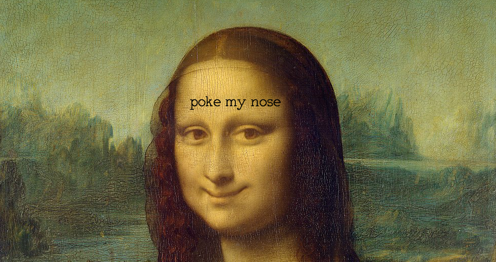

## Can you make Mona smile? 

Press the link to try out my very funny program:
https://rawgit.com/CamillaMondrup/Mini_ex/master/Mini_ex2/empty-example/index.html

### About my program 
My program is a painting of Mona Lisa. it says 'poke my nose' on her forehead, and when you click on her nose she smiles.

When i started to think about what i wanted to do in this mini-ex i got inspired by Winnie and her use of images in her code, so i really wanted to do something with that as well. I ended up using two images, one is the famouse painting of Mona Lisa by Leonardo Da Vincy, and the other one is the same image that i just made some changes to. 
I startedmy code by declaring variables for the two images and for a text type, so that i could use them later on. Then i used the preload function to make sure that everything was ready when the program started to run. In the function setup i created a canvas that was half the size of the image, because when i first tried to create a canvas with the regular size of the image, it was waaaay to big.
in the function draw i put the picture, again half the size, and then i drew a circle. I made the circle see-through because i just wanted to use it as a way to define an area, and not as something that users should see. I used the console.log function to track exactly where the coordinates of her nose is, so that i could place the circle there. 
I added some text, just to indicate to the user how you could interact with the program. 
Lastly i used the mousePressed function to create an event when the user press the mouse. I usedthe coordinates from the circle to make a variable called d that tracked the distance from the mouse to the circle and then used the 'if' function to tell the computer that if the mouse is inside the circle then the event should happen. Now that i think about it, i didn't really need to make the actual circle, because the only thing that the computer calculates is the distance from a specific set of coordinates. It was helpfull though to draw the circle, because you then had something to relate to, when writing the mousePressed function. The event that happend when the user clicks the mouse on the area around her nose is that it switches the two images, so that the image of the smiling Mona Lisa shows. Originally i wanted to make it so that when you clicked again it switched back, but i couldn't make that work.

### The notion of fun 
I think what i find the most fun about my program is the thought behind it. Obviously it is kind of funny that she smiles when you poke her nose but I think it really is 
I am really interested in art and specially in classical paintings and their history. 
Originially the Mona Lisa painting has been a subject for debate. People cannot seem 
