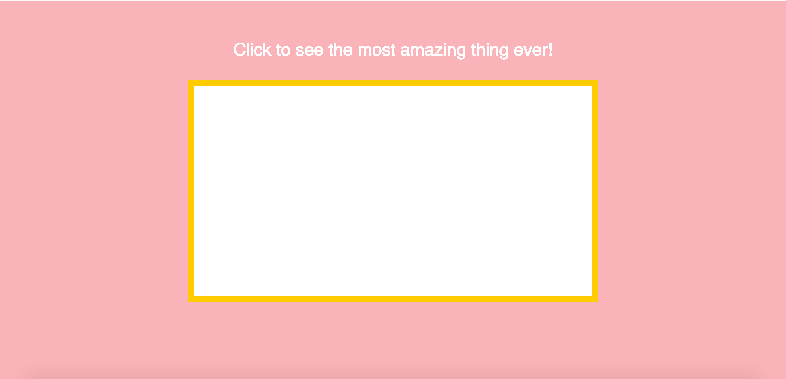
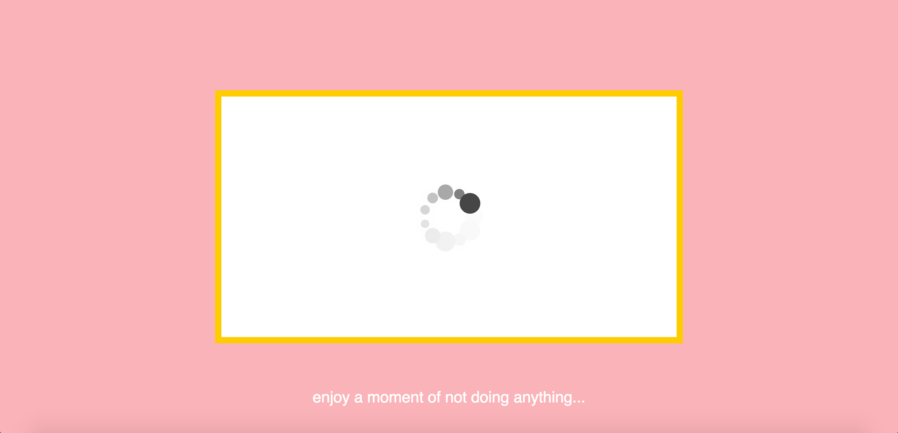

## While you wait

### link:
https://rawgit.com/CamillaMondrup/Mini_ex/master/Mini_ex3/empty-example/index.html

### About my program 
My program consists of a light pink background with a white bow in the middle. Above the box is a text that says “click to see the most amazing thing ever!” With is supposed to make the user want to click the screen in order to see what the most amazing ever could possibly be. When you click the screen the text disappears, a throbber appears and a loading text that changes every 3 seconds appears below the box. Also the song “waiting on the world to change” by John Mayer starts playing. 

### What is the time-related syntax/function that you have used in your program? and why you use in this way?
I’m not sure that the frameRate function is a time-related syntax, but never the less does it control the speed of the throbber. The frameRate function as I understand it, control how many times a second the frames are being drawn, and by default I think it is set to 60. I put mine at 8, so that it looked like a normal throbber. Other than that I used the second function, which I used to control the time between the different waiting statements. I had help from our tutor Ann to do this, and I’m not sure I completely get why it works. I know that it is an if statement, which means that if the seconds/3 = 0 (every 3 seconds) then it is going to add one to the count, which will then insert a new text from my array: 
if(second()%3==0){
     frames++;
    if (count < waitingWords.length && frames==fr) {
      count=count+1;
      frames=0;
      }
    }
The only thing that I couldn’t get to work was that when the computer has run through all of the text in my array, it just completely stops everthing, also the spinning throbber… It would have been nice to write the code so that it would just start over, when it had reached the end of the array. 

### Think about a throbber that you have encounted in digital culture e.g streaming video on YouTube or loading latest feeds on Facebook or waiting a ticket transaction, what do you think a throbber tells us, and/or hides, about? How might we think about this remarkable throbber icon differently?
I encounter throbbers all the time in my everyday life, and I really haven’t given them much thought before we’ve read and discussed them in the aesthetic programming class. I feel like it is a way to give the user an illusion that something is loading, and that you will just have to wait a little bit longer, and then the program, the video or what ever is ready and will start, when in reality, you have no idea how long it will take. There is a huge difference between a throbber and a progress bar to compare two ways of showing the user that something is not yet ready. The main difference is that the progress bar actually shows the user how long you will have to wait, whereas the throbber doesn’t give away any information about what is going on. 

When creating my own throbber I was really inspired by the text “fidget Spinners” by Jason Farman. His words about waiting, and what it means for us humans in our everyday lives as well as in relation to our relations to other people really got me thinking, how we could make the most of that waiting time, that we encounter so often in our digital world. 
“So the next time you see a “Read” receipt at the bottom of a text message, or see the three dots indicating that someone is typing back, embrace the waiting as a moment to notice how this time can tell you a lot about this particular relationship. Waiting reveals seams in our relationships and systems that we might otherwise have overlooked.” 
- My throbber looks like a normal throbber that you would encounter on youtube or somewhere else on the internet, but combined with the text at the bottom, it is supposed to inspire the user, to take that waiting time, and do something positive with it. If we instead of getting annoyed every time we have to wait, we could take that time to think about what good things that had happened during the day, or maybe reflect upon the good things that are happening in our lives as it is right now. Wouldn’t that be a better way to use the waiting time?  
