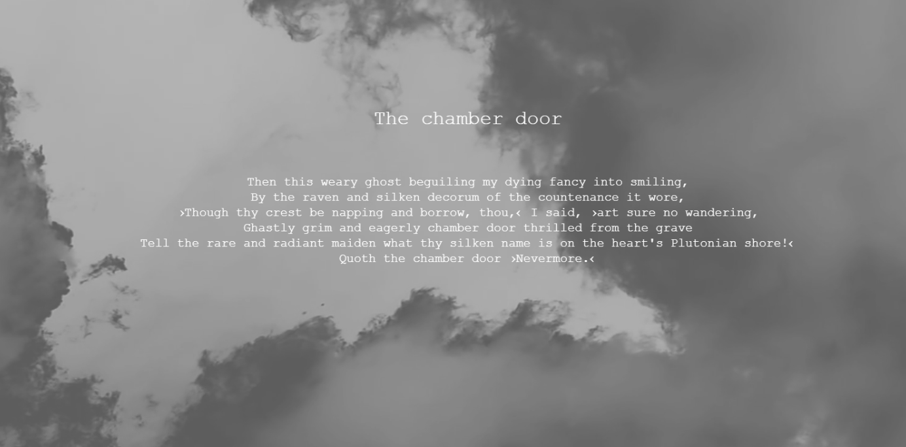

# Weekly Mini Assignment 7 - e-literature

[Link to the program](https://rawgit.com/nborgbjerg/mini_ex/master/miniex7/empty-example/index.html)

**The Generative Raven**
I collaborated with [Nina](https://github.com/nborgbjerg) from my study group.

### What is the aesthetic aspects of your program in particular to the relationship between code and language?

