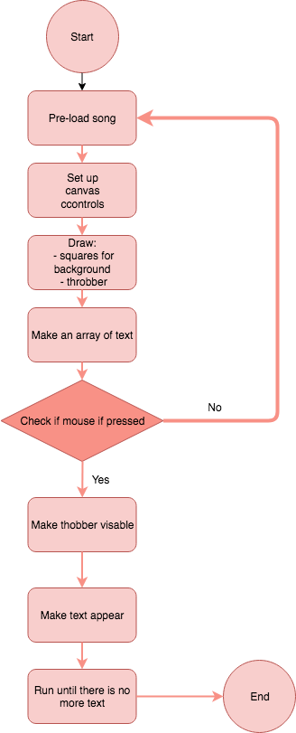

# Individual Work

### Flowchart of mini_ex3:
https://github.com/CamillaMondrup/Mini_ex/tree/master/Mini_ex3

## Making the flowchart
What i found difficult about drawing my flowchart was mostly that I had a hard time getting started and choosing what i wanted to include and exclude. It was difficult to imagening what other people would find hard to understand when looking at my program. Is it necessary to explain the very technical parts or does that even matter in relation to understanding the overall idea of my program. 
Actually I also found it challenging to structure my flowchart and I’m not really sure whether I managed it completely. It was sort of difficult for me to really sit down at look at the sequence of my program, because unusually I don’t spend too much time thinking about this, because I mostly set my program up almost automatically. 

# Group Work 
## Idea 1: Live Streak
Our program is an inspiration in between the children’s toy called a tamagotchi and  the snapchat streak phenomenon. In relation to the topic temporality, we got to talk about how we are drawn to social medias and spend a great amount of time on the platforms. We somehow wanted to express a critical comparison  between online social relations and offline social relations, and  with our product be able to motivate people to spend more ‘actual’ and  physical time with their friends. The intention of the program is that you quest to do a physical activity with one or more of your friends for example to drink coffee, share a meal, take a walk or be cultural. The purpose then is, that you are gaining more time to your tamagotchi - Time is valuta. If you don’t feed your Tamagotchi, we were thinking of some kind of consequence that would motivate you even more. Our idea of a consequence is that you are connected to your facebook account, and then your account would be blocked for a number of days, until you have fed your tamagotchi sufficiently with ‘time’. 

### Possible challenges:
It will be a challenge to get the API from Facebook to work together with our program. We are not sure what limitations Facebook might have in their API, so it might not be possible for us to get the data that we need and it might not be possible to log in as a user. We will need to do some research and try using the actual API, to know if it is working and whether we need to figure out another solution. 

We will somehow need to figure out a way to register the interactions that the user is has with other people. We are not sure if the best solution will be to use bluetooth, location on the phone or maybe even something as old-school as infrared. How to solve this we are not sure. But we need to investigate how the same program can communicate from different devices, and if we can get the program to do this it might be possible to have a form of “registration-code” that both devices can registre at the same time and in this way be connected. For this we will also need to keep in mind how it would be possible to cheat with the different methods.
 
As a consequence of not reaching your weekly goals of real-life social interactions, we thought about blocking social media accounts. This would not ruin your life, but limit you in a lot of ways. Our program will work as almost a detox of SoMe, and therefore we want to encourage the users to go out and meet people in real life. The technical difficulty of this is how we will do this, how would we get access to the social media and is it possible in any way? In a broader context, if we were to expand the program to the full idea, we would need some sort of cooperate with these big platforms; they would need to allow us to block their users. We need to find a way of doing this, how could it be possible. There could be an alternative to it as well, that will both give incitament for users to go out, but also work as a consequence.

## Idea 2: Empathybot 
The program revolves around the subject of receiving and giving empathy. In this SoME culture many people has begun to feel lonely more often because we aren't present with each other to the same extent in real life. Therefore the idea is to create a Empathybot that will be with you at any time, and be aware of your emotions. The Empathybot will mimic your facial expressions and in this way give you attention until you are not lonely anymore. 

### Possible challenges:
We need to learn how to use facetracking in Javascript, and get familiar with this. We need to create an avatar that will follow you facial expressions, and therefore different parts of the avatars face has to be connected with different tracking points on the users face, so the avatar can mimic the users expressions. 

# Individual work

### The difference between my own flowchart and the ones we did in our group:
I think that the main difference is when in the process the flowchart was made, and also why it is made (what might it be used for?). The flowchart i made by myself, was made off of a finished program, and when i made it i tried to think of how i could structure the flowchart as to use it to explain my program to other people who not necessarily is programmers themselves. The flowcharts that we made together in our group, was made before any programming was done. The flowcharts worked really well as an idea-generator. We were forced to start thinking about what we wanted to make, and what elements we wanted to incoorporate, and also how this could be done. It is a nice way to get started with our project. 

### If you have to bring the concept of algorithms from flow charts to a wider cultural context, how would you reflect the notion of algorithms? 
This topic is actually one of the ones that i found most interesting. I think it is interesting to look at something that is such a huge part of our lives, but that no one really thinks about. Algorithms are everywhere, and they are there to make our lives easier, but it seems that not that many people knows that they really are, what they do or how they work. As Finn mentions in his text: "This is the context in which we use algorithms today: as pieces of quotidian technical magic that we entrust with booking vacations, suggesting potential mates, evaluating standardized test essays, and performing many other kinds of cultural work." p. 16. He explains how most people perceive these algorithms almost like magic that just gives us the results that we need. I think it is important that people maybe become more aware of how algorithms works, because it actually is something that has a really big influence on our lives, and maybe they are not always right? 
